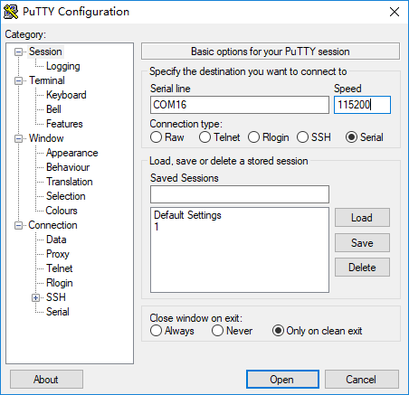
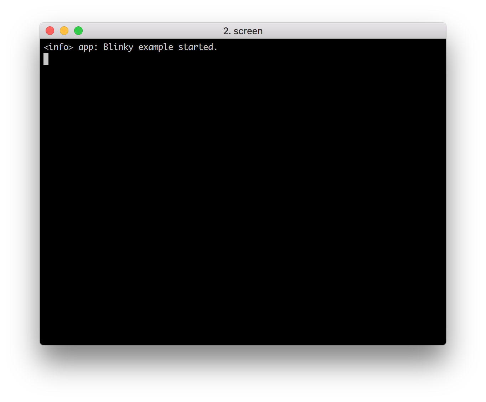
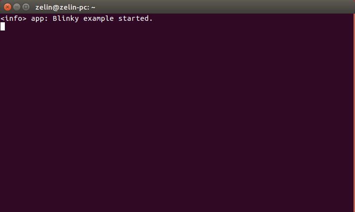

# nRF52840-MDK 快速入门指南

!!! success "感谢使用 nRF52840-MDK！"
	本指南将指引你如何快速开始 nRF52840-MDK 开发，整个过程大概需要 20 分钟。

## 包装内容

* nRF52840-MDK
* USB 3.1 Type-C to USB 2.0 Type-A Male 数据线


## 第一步：连接 nRF52840-MDK

使用包装随附的 USB 3.1 Type-C 数据线，将 nRF52840-MDK 连接至 PC，绿色电源指示灯将常亮，另外的绿色 LED 常亮表示蓝牙正在广播：


打开 PC 的资源浏览器，nRF52840-MDK 将被识别成一个名为 **DAPLINK** 的可移动磁盘设备：


## 第二步：配置串口终端

### Windows

在 Windows 环境下可能需要安装串口驱动，[点击下载](http://os.mbed.com/media/downloads/drivers/mbedWinSerial_16466.exe)并安装驱动。

!!! tip "提示"
    对于 Windows 10 以上系统，系统会自动安装驱动。

串口工具建议使用免费的 [PuTTY](https://www.chiark.greenend.org.uk/~sgtatham/putty/)，相关设置如下，串口号可以在 *设备管理器* 中查看：




### macOS

macOS 用户可直接使用系统内置的终端工具 `screen`, 具体命令如下：

``` sh
$ screen /dev/cu.usbmodem1412 115200
```

!!! tip "小技巧"
    可以在终端先输入 `screen /dev/cu.usb`，然后按下 <kbd>tab</kbd>，设备名称将自动补齐。

    按下 <kbd>Ctrl</kbd> + <kbd>A</kbd>，在按下 <kbd>Ctrl</kbd> + <kbd>K</kbd>，在窗口底部会出现提示符 `[y/n]`，输入 <kbd>y</kbd> 即可退出串口终端。



### Linux

在 Linux 环境下同样可以使用 `screen` 工具，这里以 Ubuntu 16.04 为例：

``` sh
$ sudo apt-get install screen
```

``` sh
$ sudo screen /dev/ttyACM0 115200
```



## 第三步：使用 nRF Connect

1. 从 App Store 或 Google Play 下载 *nRF Connect* 应用；

	!!! tip "提示"
		最新 Android 版本的 nRF Connect 应用也可以从 Nordic 的 [Android-nRF-Connect](https://github.com/NordicSemiconductor/Android-nRF-Connect/releases) 下载。

2. 打开 app，扫描设备，你将看到名为 *nRF52840-MDK* 的设备正在广播，连接该设备；
3. 蓝色 LED 亮、绿色 LED 灭，表明设备从广播态进入连接态，同时可以观察到该设备能够提供的服务；
4. 打开 `Nordic Blinky Button` 属性（`0x1524`）的通知，按下/释放板子上的 USER Button，可观察按钮状态的改变；
5. 先后对 *Nordic Blinky LED* 属性 (0x1525) 写入 `01` 、`00`，可观察到 LED 的状态变化。

[](../../getting-started/images/ble_app_blinky_demo.jpg)

!!! tip "提示"
    该演示 demo 源码位于 `./nrf52840-mdk/examples/nrf5-sdk/ble_app_blinky`。
    
## 如何下载固件？

nRF52840-MDK 板上集成了 DAPLink 多功能调试器，可用于下载固件、调试代码、输出调试信息。目前支持以下两种下载方式：

* [“拖放”下载](#_4)
* [使用 pyOCD 下载](#pyocd)

你可以使用 [Heart rate monitor](https://github.com/makerdiary/nrf52840-mdk/tree/master/examples/nrf5-sdk/ble_app_hrs/) 作为示例，可从以下链接获得 `hex` 固件。

<a href="https://github.com/makerdiary/nrf52840-mdk/tree/master/examples/nrf5-sdk/ble_app_hrs/hex"><button data-md-color-primary="marsala">下载固件</button></a>


### “拖放”下载

将 nRF52840-MDK 连接到 PC，系统会自动识别到 **DAPLINK** 可移动磁盘，直接把 `.hex` 固件拖放到该磁盘即可开始下载，等待下载完成....


下载完成后，按下复位按钮便可运行新固件。

!!! note "提示"
	对于包含蓝牙协议栈（SoftDevice）的应用，需要先使用 `mergehex` 工具合并应用程序固件和 SoftDevice 协议栈。 `mergehex` 包含在 [nRF5x Command Line Tools](http://infocenter.nordicsemi.com/index.jsp?topic=%2Fcom.nordic.infocenter.tools%2Fdita%2Ftools%2Fnrf5x_command_line_tools%2Fnrf5x_installation.html) 工具包中。

### 使用 pyOCD 下载

[pyOCD](https://github.com/mbedmicro/pyOCD) 是一个开源、跨平台的 python 库，支持 Linux, macOS, Windows 系统，可对 ARM Cortex-M 系列 MCU 进行编程和调试，甚至可以利用其提供的 API 实现更复杂的功能。

可以通过 [pip](https://pip.pypa.io/en/stable/index.html) 安装最新稳定版：

``` sh
$ pip install --pre -U pyocd
```

或者，可以尝试安装最新开发版本，体验一些正在开发中的新功能：

``` sh
$ pip install --pre -U https://github.com/mbedmicro/pyOCD/archive/master.zip
```

!!! note "注意"
    有的系统(例如 Ubuntu )可能会因为权限问题导致无法正常使用 pyOCD，需要在安装命令前增加 `sudo -H` 进行全局安装。

通过以下命令可完成固件下载、擦除：

``` sh
# -se 表示只擦除需要用到的区域
$ pyocd-flashtool -d debug -t nrf52 -se your-hex-file.hex

# 如果需要整片擦除，可以使用 -ce 参数
$ pyocd-flashtool -d debug -t nrf52 -ce your-hex-file.hex

# 如果只是想擦除，不编程，可以不带hex文件参数
$ pyocd-flashtool -d debug -t nrf52 -ce
```


### 验证新固件

下载完成后，可使用 **nRF Toolbox** app 验证新固件是否正常工作：打开 nRF Toolbox，选择 **HRM** 工具，连接 *Nordic_HRM* 设备，即可查看心率数据：


## 下载项目源码

nRF52840-MDK 的所有示例代码及文档托管在 GitHub [makerdiary/nrf52840-mdk](https://github.com/makerdiary/nrf52840-mdk) 仓库，你可以自由下载或克隆到你的工作目录下使用：

``` sh
$ git clone https://github.com/makerdiary/nrf52840-mdk.git
```

## 问题反馈

如果在开发过程遇到任何问题，可以通过 [GitHub Issue](https://github.com/makerdiary/nrf52840-mdk/issues) 寻求解决。

<a href="https://github.com/makerdiary/nrf52840-mdk/issues/new"><button data-md-color-primary="marsala"><i class="fa fa-github"></i> 创建 Issue</button></a>


