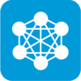
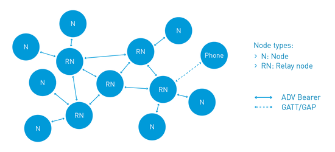
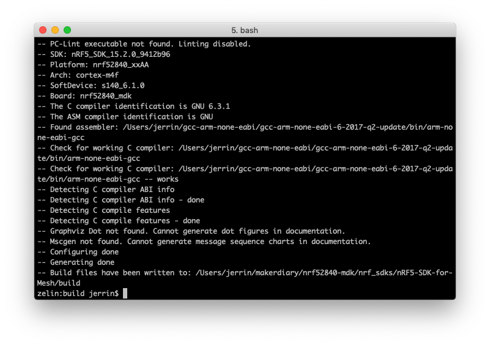
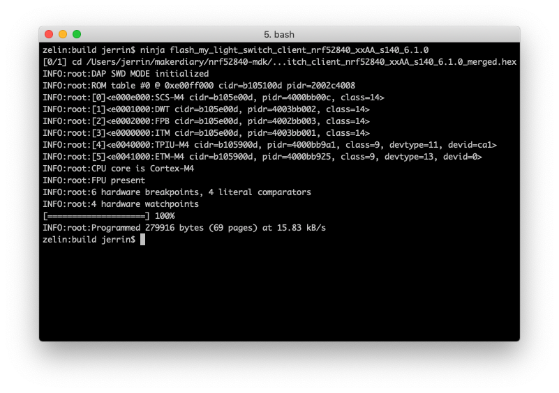
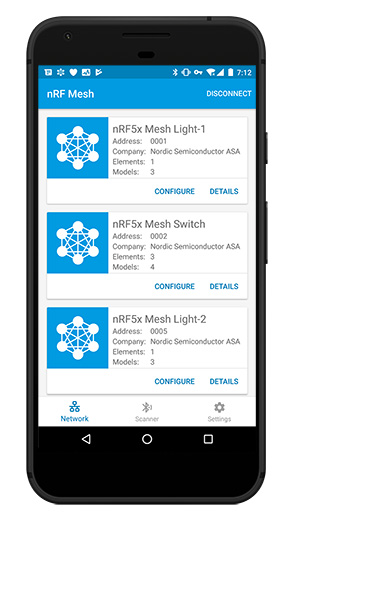

# nRF5 SDK for Mesh <br><small>Nordic 官方的 Bluetooth Mesh 软件开发包</small>

[](https://www.nordicsemi.com/Software-and-Tools/Software/nRF5-SDK-for-Mesh)

## 简介

The nRF5 SDK for Mesh 是 Nordic 为在 nRF5 系列芯片上运行标准 [Bluetooth Mesh](https://www.bluetooth.com/bluetooth-technology/topology-options/le-mesh) 协议而推出的软件开发包。利用该软件开发包，开发者可以很方便地构建 Bluetooth Mesh 应用。

mesh 是低功耗蓝牙的一种全新网络拓扑结构选择，于2017年夏季推出。它代表蓝牙技术的一项重要进展，将蓝牙定位为包括智能楼宇和工业物联网在内的各大新领域和新用例的主流低功耗无线通信技术。

在 mesh 网络中，中继节点（RN）会将接收到的数据包不断广播下去，直到目标节点（N）收到该数据包为止，这是一种称为‘泛洪（flooding）’的网络结构。



你可以在 Bluetooth SIG 了解更多关于 Bluetooth Mesh 的介绍：

* [Bluetooth Mesh 简介](https://blog.bluetooth.com/introducing-bluetooth-mesh-networking)

* [Bluetooth Mesh 协议规范](https://www.bluetooth.com/specifications/mesh-specifications?_ga=2.18257471.723078495.1501226603-93769939.1480503530)

更多关于 nRF5 SDK for Mesh 介绍, 可以前往 [nordicsemi.com](https://www.nordicsemi.com/en/DocLib/Content/SDK_Doc/Mesh_SDK/v3-0-0/index)。

本文档主要介绍如何快速搭建开发环境、编译运行 Bluetooth Mesh 示例。

## 安装 Mesh 工具链

在开始编译之前，需要安装 `CMake`、`GNU Arm Toolchain`、`ninja` 工具。这里分别介绍在 [macOS](#macos)、[Windows](#windows)、[Linux](#linux) 系统上安装相关工具。

### macOS

1. 使用 `brew` 命令安装 [CMake](https://cmake.org/) and [Ninja](https://ninja-build.org/)：

    ``` sh
    brew install cmake ninja
    ```

2. 下载并安装 [GNU ARM Embedded Toolchain](https://developer.arm.com/open-source/gnu-toolchain/gnu-rm/downloads). 建议使用 `6-2017-q2-update` 版本，然后将工具链的目录添加到系统环境变量中：

    ``` sh
    # 在 ~/.bash_profile 文件中添加以下命令：
    export PATH="<path to install directory>/gcc-arm-none-eabi-6-2017-q2-update/bin:${PATH}"
    ```

3. 验证 `arm-none-eabi-gcc` 是否配置正确：

    ``` sh
    arm-none-eabi-gcc --version
    ```

4. 为方便后续烧录固件，还需要安装 [nRF5x Command Line Tools](https://www.nordicsemi.com/DocLib/Content/User_Guides/nrf5x_cltools/latest/UG/cltools/nrf5x_installation) 和 [pyOCD](https://github.com/mbedmicro/pyOCD#installing)。

### Windows

在 Windows 系统上最简单的方法是使用 Windows 包管理器 [Chocolatey](https://chocolatey.org/)。

1. 按照 [Chocolatey 安装页面](https://chocolatey.org/install) 介绍安装 **Chocolatey**
2. 以管理员身份运行命令行工具(`cmd.exe`)

3. 为避免每安装一个程序都需要单独确认一遍，可使能 `allowGlobalConfirmation`：

    ``` sh
    choco feature enable -n allowGlobalConfirmation
    ```

4. 安装 **CMake**：

    ``` sh
    choco install cmake --installargs 'ADD_CMAKE_TO_PATH=System'
    ```

5. 安装其他工具，安装完成后关闭命令行工具：

    ``` sh
    choco install git python ninja
    ```

6. 下载并安装 [GNU ARM Embedded Toolchain](https://developer.arm.com/open-source/gnu-toolchain/gnu-rm/downloads)。建议使用 `6-2017-q2-update` 版本，然后将工具链的目录添加到系统环境变量中

7. 为方便后续烧录固件，还需要安装 [nRF5x Command Line Tools](https://www.nordicsemi.com/DocLib/Content/User_Guides/nrf5x_cltools/latest/UG/cltools/nrf5x_installation) 和 [pyOCD](https://github.com/mbedmicro/pyOCD#installing)。

### Linux

这里以 **Unbuntu** 为例介绍如何配置开发环境，其他 Linux 发行版与此类似。

1. 确认系统已经更新完成：

    ``` sh
    sudo apt-get update
    sudo apt-get upgrade
    ```

2. 使用 `apt-get` 安装以下工具：

    ``` sh
    sudo apt-get install --no-install-recommends git cmake ninja-build python3-pip
    ```

3. 下载并安装 [GNU ARM Embedded Toolchain](https://developer.arm.com/open-source/gnu-toolchain/gnu-rm/downloads). 建议使用 `6-2017-q2-update` 版本，然后将工具链的目录添加到系统环境变量中

4. 为方便后续烧录固件，还需要安装 [nRF5x Command Line Tools](https://www.nordicsemi.com/DocLib/Content/User_Guides/nrf5x_cltools/latest/UG/cltools/nrf5x_installation) 和 [pyOCD](https://github.com/mbedmicro/pyOCD#installing)。


## 克隆源码仓库

从 GitHub 克隆 `nrf52840-mdk` 仓库：

``` sh
git clone ---recursive https://github.com/makerdiary/nrf52840-mdk.git
```

如果已经克隆过该仓库，可使用以下命令更新 `nRF5-SDK-for-Mesh` 子模块：

``` sh
git submodule update --init
```

`nRF5 SDK for Mesh` 需要配合 `nRF5 SDK` 一起编译，可参考以下链接进行安装：

<a href="https://github.com/makerdiary/nrf52840-mdk/tree/master/nrf_sdks#installing-the-nrf5-sdk"><button data-md-color-primary="marsala">安装 nRF5 SDK</button></a>

## 编译 Mesh 协议栈和示例

现在你可以开始编译 Mesh 协议栈和相关示例，最简单的方法是在 `nrf_sdks/nRF5-SDK-for-Mesh` 目录创建 `build` 文件夹，用来存放 ninja 生成的文件：

``` sh
nRF5-SDK-for-Mesh$ mkdir build && cd build
```

接着使用 `cmake` 工具来编译，你需要指定 `TOOLCHAIN`、`PLATFORM`、`BOARD` 参数，系统会自动确定可用的 `SOFTDEVICE`：

``` sh
cmake -G Ninja -DTOOLCHAIN=gccarmemb -DPLATFORM=nrf52840_xxAA -DBOARD=nrf52840_mdk -DFLASHER=pyocd ..
```

生成编译文件后便可使用 `ninja <target>` 命令进行编译，这里以 `my_light_switch_client` 为例：

``` sh
ninja my_light_switch_client_nrf52840_xxAA_s140_6.1.0
```



## 下载运行 mesh 示例

连接 nRF52840-MDK 开发板，使用 `ninja flash_<your target>` 命令可以自动下载运行示例：

``` sh
ninja flash_my_light_switch_client_nrf52840_xxAA_s140_6.1.0
```



使用串口调试工具（如：[PuTTY](https://www.chiark.greenend.org.uk/~sgtatham/putty/) 或者 [screen](https://www.gnu.org/software/screen/manual/screen.html)）打印调试信息：

``` sh
screen /dev/cu.usbmodem141102 115200
```


以同样的步骤在其他 nRF52840-MDK 开发板上下载 **Server** 示例：

``` sh
ninja flash_my_light_switch_server_nrf52840_xxAA_s140_6.1.0
```

至此，你可以使用 [nRF Mesh mobile app](https://www.nordicsemi.com/Software-and-Tools/Development-Tools/nRF-Mesh)([iOS](https://itunes.apple.com/us/app/nrf-mesh/id1380726771?mt=8)/[Android](https://play.google.com/store/apps/details?id=no.nordicsemi.android.nrfmeshprovisioner)) 来建立 Bluetooth Mesh 网络：




## 如何创建新项目

你也可以从头创建新项目，最简单的方式是：

1. 从 `examples` 目录复制现有的示例，例如：复制 `examples/my_beaconing`，并改为 `examples/my_app`；
2. 修改 `examples/CMakeLists.txt` 文件，添加 `add_subdirectory("my_app")` 命令；
3. 修改 `examples/my_app/CMakeLists.txt` 文件，修改 target：`set(target "my_app")`；
4. 生成编译文件：

    ``` sh
    nRF5-SDK-for-Mesh $ mkdir build && cd build
    build $ cmake -G Ninja -DTOOLCHAIN=gccarmemb -DPLATFORM=nrf52840_xxAA -DBOARD=nrf52840_mdk -DFLASHER=pyocd ..
    ```

5. 编译新的目标示例：
    ``` sh
    ninja my_app
    ```

6. 下载固件：

    ``` sh
    ninja flash_my_app
    ```

## 更多示例

至此，你应该已经掌握如何编译运行基于 nRF5 SDK for Mesh 的示例，我们还会不断增加一些新的示例到 [nrf52840-mdk](https://github.com/makerdiary/nrf52840-mdk) 仓库中，敬请关注！

## 参考资源

* [Nordic nRF5 SDK for Mesh 文档](https://www.nordicsemi.com/en/DocLib/Content/SDK_Doc/Mesh_SDK/v3-0-0/index)
* [nRF5-SDK-for-Mesh 仓库](https://github.com/makerdiary/nRF5-SDK-for-Mesh)
* [Bluetooth Mesh 基本概念](https://www.nordicsemi.com/en/DocLib/Content/SDK_Doc/Mesh_SDK/v3-0-0/md_doc_introduction_basic_concepts)
* [nRF5 SDK for Mesh 架构](https://www.nordicsemi.com/en/DocLib/Content/SDK_Doc/Mesh_SDK/v3-0-0/md_doc_introduction_basic_architecture)

## 问题反馈

如果在开发过程遇到任何问题，可以通过 [GitHub Issue](https://github.com/makerdiary/nrf52840-mdk/issues) 寻求解决。

<a href="https://github.com/makerdiary/nrf52840-mdk/issues/new"><button data-md-color-primary="marsala"><i class="fa fa-github"></i> 创建 Issue</button></a>

