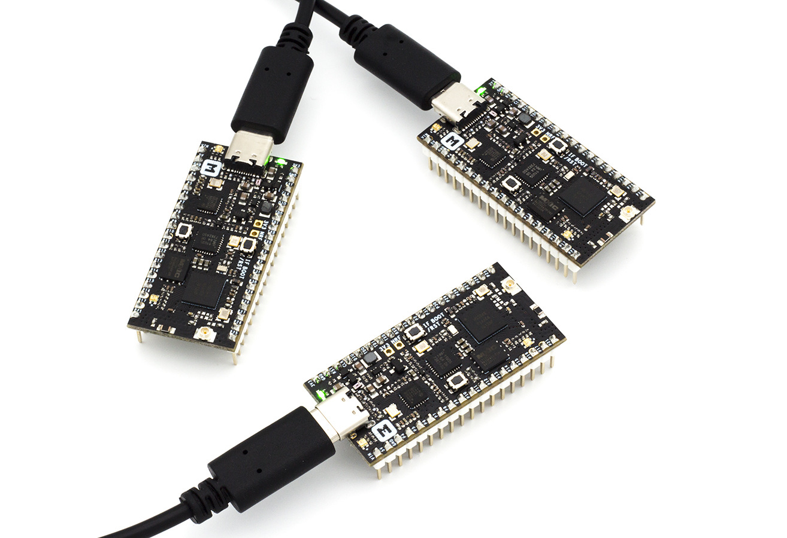
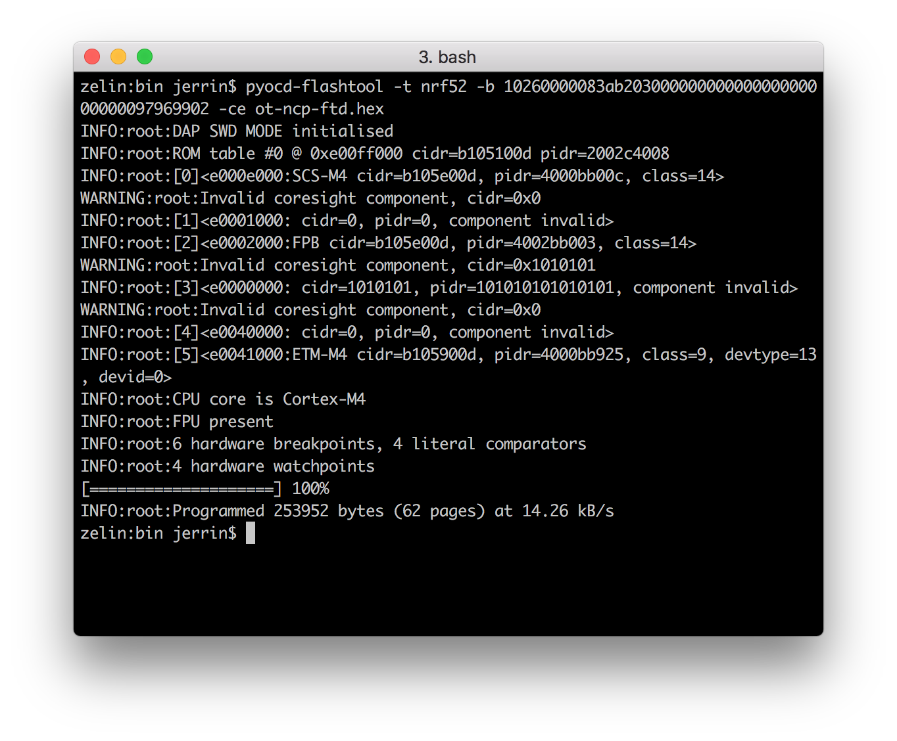

# OpenThread <br><small>Nest 发布的 Thread® 的开源实现方案</small>

[](https://github.com/openthread/openthread)

## 简介

[OpenThread](https://openthread.io/) 是 [Nest Labs](https://nest.com/) 发布的 [Thread®](http://threadgroup.org/) 的开源实现方案。OpenThread 已经广泛应用于 Nest 产品中，可以帮助开发者快速开发智能家居产品。

[Thread®](http://threadgroup.org/ThreadSpec) 是一种为家庭和楼宇自动化而建立的开放式标准，以实现可靠、具有成本效益和低功耗的通信：

* 安全的无线网格网络协议
* 基于 IPv6 的开放协议，支持轻松连接到现有网络
* 支持使用智能手机轻松调试
* 支持器件到器件、器件到移动设备和器件到云的无线通信


本章节将介绍如何使用 nRF52840-MDK 创建一个 Thread 网络，并在不同节点间发送消息。



## 快速入门

在开发 OpenThread 应用之前，你需要安装一些开发工具。

### 安装 ARM GNU Toolchain

GNU Arm Embedded Toolchain 是 Arm 公司提供的 GNU 开源工具链，集成 GCC 交叉编译器、标准库以及其他实用工具，使开发者能够轻松开发基于 Arm Cortex-M 和 Cortex-R 的软件。该工具支持跨平台，可以运行在 Windows，Linux 和 macOS 平台上。

你可以通过以下链接下载该工具链：

<a href="https://developer.arm.com/open-source/gnu-toolchain/gnu-rm/downloads"><button data-md-color-primary="marsala">下载工具链</button></a>


下载、安装 `6-2017-q2-update` 版本，并将工具链的目录添加到系统环境变量中：

``` sh
# in ~/.bash_profile, add the following script
export PATH="<path to install directory>/gcc-arm-none-eabi-6-2017-q2-update/bin:${PATH}"
```

可通过以下命令验证是否安装成功：

``` sh
$ arm-none-eabi-gcc --version
```

### 安装 pyOCD

[pyOCD](https://github.com/mbedmicro/pyOCD) 是一个开源、跨平台的 python 库，支持 Linux, macOS, Windows 系统，可对 ARM Cortex-M 系列 MCU 进行编程和调试，甚至可以利用其提供的 API 实现更复杂的功能。

可以通过 [pip](https://pip.pypa.io/en/stable/index.html) 安装最新稳定版：

``` sh
$ pip install --pre -U pyocd
```

!!! note "提示"
	如果安装 pyOCD 过程遇到问题，可以参考 “[使用 pyOCD 下载](../getting-started/#pyocd)” 部分。

### 安装 wpantund

[wpantund](https://github.com/openthread/wpantund) 是运行在类 Unix 操作系统用户空间的网络接口驱动程序，为低功耗无线协处理器（NCP）提供本地 IPv6 网络接口，由 Nest Labs 开发和维护。

你可以按照 “[wpantund 安装指南](https://github.com/openthread/wpantund/blob/master/INSTALL.md)” 安装 **wpantund**。

### 克隆 OpenThread 源码

克隆 OpenThread 源码，并安装：

``` sh
$ cd ~
$ git clone --recursive https://github.com/openthread/openthread.git
$ cd openthread
$ ./bootstrap
```

修改平台配置文件 `openthread/examples/platforms/nrf52840/platform-config.h` 的串口配置以适配 nRF52840-MDK：

``` c
/**
 * @def UART_HWFC
 *
 * UART Hardware Flow Control.
 *
 * @brief Possible values:
 *         \ref NRF_UART_HWFC_ENABLED - HW Flow control enabled.
 *         \ref NRF_UART_HWFC_DISABLED - HW Flow control disabled.
 *
 */
#ifndef UART_HWFC
#define UART_HWFC NRF_UART_HWFC_DISABLED
#endif

/**
 * @def UART_PIN_TX
 *
 * UART TX Pin.
 *
 */
#ifndef UART_PIN_TX
#define UART_PIN_TX 20
#endif

/**
 * @def UART_PIN_RX
 *
 * UART RX Pin.
 *
 */
#ifndef UART_PIN_RX
#define UART_PIN_RX 19
#endif
```

完成以上准备工作，便可以开始编译下载 OpenThread。

## 设置 NCP Joiner

### 编译下载 NCP 固件

Thread 网络中的设备使用 **Joiner** 角色可以被安全地认证和许可，这里我们将为 nRF52840-MDK 编译下载具有 **Joiner** 功能的固件。

!!! tip "提示"
	每次编译之前建议使用 `make clean` 清除前面已经编译过的版本。

``` sh
$ cd ~/openthread
$ make -f examples/Makefile-nrf52840 clean
$ make -f examples/Makefile-nrf52840 JOINER=1
```

!!! tip "了解更多"
	如果需要了解更多关于编译配置 OpenThread 的内容，可以参考 “[Building OpenThread](https://openthread.io/guides/building/)”。

切换到输出目录，将 OpenThread FTD NCP 二进制文件转换为 hex 文件：

``` sh
$ cd ~/openthread/output/nrf52840/bin
$ arm-none-eabi-objcopy -O ihex ot-ncp-ftd ot-ncp-ftd.hex
```

将 nRF52840-MDK 连接到 PC，使用 `pyocd-flashtool -l` 获取该板子的 `boardId`:

``` sh
$ pyocd-flashtool -l

WARNING:root:Unsupported board found 1026
0 => Unknown Board [cortex_m] boardId => 10260000083ab20300000000000000000000000097969902
```

使用该 `boardId` 下载前面编译完成的 OpenThread NCP FTD hex 文件：

``` sh
$ pyocd-flashtool -t nrf52 -b 10260000083ab20300000000000000000000000097969902 -ce ot-ncp-ftd.hex
```



!!! tip "提示"
	将该板子标记为 **NCP**，以避免与后面其他角色的设备混淆。

### 配置 wpantund

在 NCP 的设计中，使用 `wpantund` 工具来连接和管理 Thread 设备。 

在命令行终端中，启动 `wpantund` 、创建 `utun7` 接口并使能 log 信息输出：

``` sh
$ sudo /usr/local/sbin/wpantund -o Config:NCP:SocketPath /dev/cu.usbmodem14112  \
        -o Config:TUN:InterfaceName utun7 \
        -o Daemon:SyslogMask " -info"
```

!!! tip "提示"
	你也可以把上面相关的配置写到 `/etc/wpantund.conf` 配置文件中，这样就不需要每次都重新配置 wpantund。

如果配置成功，将会有以下类似信息输出：

``` sh
Jun  9 01:29:49  wpantund[12257] <Notice>: Starting wpantund 0.08.00d (Jun  9 2018 00:31:51) . . .
Jun  9 01:29:49  wpantund[12257] <Notice>: 	SOURCE_VERSION = 0.07.01-217-g86d29d6
Jun  9 01:29:49  wpantund[12257] <Notice>: 	BUILD_VERSION = 0.07.01-217-g86d29d6
Jun  9 01:29:49  wpantund[12257] <Notice>: Configuration file "/etc/wpantund.conf" read.
Jun  9 01:29:49  wpantund[12257] <Notice>: Ready. Using DBUS bus ":1.2"
Jun  9 01:29:49  wpantund[12257] <Notice>: Running as root without dropping privileges!
Jun  9 01:29:49  wpantund[12257] <Notice>: State change: "uninitialized" -> "offline"
Jun  9 01:29:49  wpantund[12257] <Notice>: NCP is running "OPENTHREAD/20170716-00584-ge4f5f240-dirty; NRF52840; Jun  8 2018 23:36:19"
Jun  9 01:29:49  wpantund[12257] <Notice>: Driver is running "0.08.00d (0.07.01-217-g86d29d6; Jun  9 2018 00:31:51)"
1:29:49  wpantund[12257] <Notice>: Network is not joinable
Jun  9 01:29:49  wpantund[12257] <Notice>: Resetting interface(s). . .
Jun  9 01:29:49  wpantund[12257] <Notice>: Finished initializing NCP
```

保留这个终端窗口，查看输出的 log 信息以便定位问题。

使用另外的工具 `wpanctl` 来控制管理 **NCP** 设备：

``` sh
$ sudo /usr/local/bin/wpanctl -I utun7
wpanctl:utun7>
```

### 验证 NCP 是否工作

使用 `status` 命令验证 NCP 是否正常工作：


## 设置 FTD 设备

另外两个 nRF52840-MDK 将被配置为 FTD 设备（Full Thread Devices），这类设备上运行 OpenThread CLI 固件，你可以直接通过设备的串口对其进行配置管理。

这两个设备一个配置为 `Commissioner` 角色，用于在 Thread 网络中认证和许可其他设备；另外一个配置为 `Joiner` 角色，可以被 `Commissioner` 安全地认证和许可。

### 编译下载 CLI 固件

为 nRF52840-MDK 编译 `Commissioner` 和 `Joiner` 角色的固件，为了方便我们同时使能这两个宏：

``` sh
$ cd ~/openthread
$ make -f examples/Makefile-nrf52840 clean
$ make -f examples/Makefile-nrf52840 COMMISSIONER=1 JOINER=1
```

!!! tip "提示"
	为了避免冗余，建议单一角色的设备使能特定的宏，例如：只作为 `Joiner` 角色的设备，只开启 `JOINER=1` 的。

切换到输出目录，将二进制文件转换为 hex 文件：
``` sh
$ cd ~/openthread/output/nrf52840/bin
$ arm-none-eabi-objcopy -O ihex ot-cli-ftd ot-cli-ftd.hex
```

连接 nRF52840-MDK，烧录固件：

``` sh
$ pyocd-flashtool -l
WARNING:root:Unsupported board found 1026
WARNING:root:Unsupported board found 1026
0 => Unknown Board [cortex_m] boardId => 10260000083ac27f00000000000000000000000097969902
1 => Unknown Board [cortex_m] boardId => 10260000083ab20300000000000000000000000097969902

$ pyocd-flashtool -t nrf52 -b 10260000083ac27f00000000000000000000000097969902 -ce ot-cli-ftd.hex

```

!!! tip "提示"
	将该板子标记为 **Commissioner**，以避免与其他角色的设备混淆。

### 验证 CLI 是否工作

打开串口，使用 `ipaddr` 查看设备 IP：

``` sh
$ screen /dev/cu.usbmodem142112 115200
```

``` sh
> ipaddr
fd11:2233:4455:0:99ea:1fe9:acd6:d384
fe80:0:0:0:2003:a240:810f:1598
Done
```

### 设置 FTD Joiner

重复以上操作，为另外一个 nRF52840-MDK 烧录 `ot-cli-ftd.hex` 固件，将其配置为 **FTD Joiner** 设备，并做好标记。

打开串口，使用 `ipaddr` 查看设备 IP：

``` sh
$ screen /dev/cu.usbmodem142412 115200
```

``` sh
> ipaddr
fe80:0:0:0:d079:7d86:6413:4f4e
fd11:2233:4455:0:e839:eb52:f7ec:74e3
Done
```

## 建立 Thread 网络

准备就绪，我们可以开始建立一个 Thread 网络，在 **FTD Commissioner** 设置配置窗口，开始配置该网络参数：

``` sh
## FTD Commissioner ##
----------------------

> networkname makerdiary
Done
> extpanid 1122334455667788
Done
> panid 0x1122
Done
> masterkey 11223344556677881122334455667788
Done
> ifconfig up
Done
> thread start
Done
```

过一会，查看该设备状态，它将成为 **Leader** 角色，你可以使用 `rloc16` 查看其 RLOC16 地址：

``` sh
## FTD Commissioner ##
----------------------

> state
leader
Done
> rloc16
3400
Done
```

检查该设备的 IPv6：

``` sh
## FTD Commissioner ##
----------------------

> ipaddr
fd11:2233:4455:0:0:ff:fe00:fc00        # Leader Anycast Locator (ALOC)
fd11:2233:4455:0:0:ff:fe00:3400        # Routing Locator (RLOC)
fd11:2233:4455:0:99ea:1fe9:acd6:d384   # Mesh-Local EID (ML-EID)
fe80:0:0:0:2003:a240:810f:1598         # Link-Local Address (LLA)
Done
```

!!! tip
	一个 Thread 设备可以有多个 IPv6 地址，可以通过 “[IPv6 Addressing](https://openthread.io/guides/thread_primer/ipv6_addressing#unicast_address_types)” 了解更多内容。


这时，一个名为 `makerdiary` 的 Thread 网络已经建立，并且可以被其他设备发现，可在 **NCP Joiner** 和 **FTD Joiner** 的 `wpanctl` 窗口使用 `scan` 命令扫面发现网络：

``` sh
## NCP Joiner ##
----------------

wpanctl:utun7> scan
   | Joinable | NetworkName        | PAN ID | Ch | XPanID           | HWAddr           | RSSI
---+----------+--------------------+--------+----+------------------+------------------+------
 1 |       NO | "makerdiary"       | 0x1122 | 11 | 1122334455667788 | 2203A240810F1598 |  -59
```

``` sh
## FTD Joiner ##
----------------

> scan
| J | Network Name     | Extended PAN     | PAN  | MAC Address      | Ch | dBm | LQI |
+---+------------------+------------------+------+------------------+----+-----+-----+
> | 0 | makerdiary       | 1122334455667788 | 1122 | 2203a240810f1598 | 11 | -32 | 244 |
Done
```

接下来，我们可以让 **NCP Joiner** 加入到该网络中：

``` sh
## NCP Joiner ##
----------------

wpanctl:utun7> setprop Network:Key 11223344556677881122334455667788
wpanctl:utun7> join 1
Joining "makerdiary" 1122334455667788 as node type "end-device"
Successfully Joined!
```

使用 `status` 查看状态，该设备已经成功加入并分配了对应的 IPv6 地址： 

``` sh
## NCP Joiner ##
----------------

wpanctl:utun7> status
utun7 => [
	"NCP:State" => "associated"
	"Daemon:Enabled" => true
	"NCP:Version" => "OPENTHREAD/20170716-00650-g631557e8-dirty; NRF52840; Jun  9 2018 15:45:03"
	"Daemon:Version" => "0.08.00d (0.07.01-217-g86d29d6; Jun  9 2018 00:31:51)"
	"Config:NCP:DriverName" => "spinel"
	"NCP:HardwareAddress" => [9019EC5D617D7AAB]
	"NCP:Channel" => 11
	"Network:NodeType" => "end-device"
	"Network:Name" => "makerdiary"
	"Network:XPANID" => 0x1122334455667788
	"Network:PANID" => 0x1122
	"IPv6:LinkLocalAddress" => "fe80::60bd:ff84:2121:344d"
	"IPv6:MeshLocalAddress" => "fd11:2233:4455::f:b5e:169b:b875"
	"IPv6:MeshLocalPrefix" => "fd11:2233:4455::/64"
	"com.nestlabs.internal:Network:AllowingJoin" => false
]
```

获取 **NCP Joiner** 的 RLOC16 地址：

``` sh
## NCP Joiner ##
----------------

wpanctl:utun7> getprop Thread:RLOC16
Thread:RLOC16 = 0x3403
```

回到 **FTD Commissioner**，可以查看 `router table` 和 `child table`：

``` sh
## FTD Commissioner ##
----------------------

> router table
| ID | RLOC16 | Next Hop | Path Cost | LQ In | LQ Out | Age | Extended MAC     |
+----+--------+----------+-----------+-------+--------+-----+------------------+
| 13 | 0x3400 |       63 |         0 |     0 |      0 |   0 | 2203a240810f1598 |

Done
> child table
| ID  | RLOC16 | Timeout    | Age        | LQ In | C_VN |R|S|D|N| Extended MAC     |
+-----+--------+------------+------------+-------+------+-+-+-+-+------------------+
|   3 | 0x3403 |        240 |         66 |     3 |   86 |1|1|1|1| 62bdff842121344d |

Done
```

使用 `ping` 命令检查连接：

``` sh
## FTD Commissioner ##
----------------------

> ping fd11:2233:4455::f:b5e:169b:b875
> 8 bytes from fd11:2233:4455:0:f:b5e:169b:b875: icmp_seq=2 hlim=64 time=35ms
```

至此，我们已经建立了具有两个节点的 Thread 网络，其网络拓扑如下：


## 许可 FTD Joiner

接下来，我们让 **FTD Joiner** 加入到 `makerdiary` 网络中。

先在 **FTD Joiner** 中扫描网络：

``` 
## FTD Joiner ##
----------------

> scan
| J | Network Name     | Extended PAN     | PAN  | MAC Address      | Ch | dBm | LQI |
+---+------------------+------------------+------+------------------+----+-----+-----+
> | 0 | makerdiary       | 1122334455667788 | 1122 | 2203a240810f1598 | 11 | -32 | 244 |
Done
```

`J` 列的值为 `0`，表示该设备未被许可加入到 `makerdiary` 中。接下来我们就演示如何许可 **FTD Joiner** 加入到网络中。

先查看 **FTD Joiner** 的 `eui64`：

``` sh
## FTD Joiner ##
----------------

> eui64
31ae3e8e7b87cfd6
Done
```

在 **FTD Commissioner** 对该 `eui64` 进行许可：

``` sh
## FTD Commissioner ##
----------------------

> commissioner start
Done
> commissioner joiner add 31ae3e8e7b87cfd6 J01NME
Done
```

回到 **FTD Joiner**，再次扫描网络：

``` sh
## FTD Joiner ##
----------------

> scan
| J | Network Name     | Extended PAN     | PAN  | MAC Address      | Ch | dBm | LQI |
+---+------------------+------------------+------+------------------+----+-----+-----+
> | 1 | makerdiary       | 1122334455667788 | 1122 | 2203a240810f1598 | 11 | -32 | 244 |
Done
```

可发现 `J` 状态已变成 `1`，表示此时我们可以让该设备加入到网络中：

``` sh
## FTD Joiner ##
----------------

> ifconfig up
Done
> joiner start J01NME
Done
```

等待一会，会发现显示是否加入成功：

``` sh
## FTD Joiner ##
----------------

>Join success
```

这时我们就可以启动 **FTD Joiner** 了：

``` sh
## FTD Joiner ##
----------------

> thread start
Done
> state
child
Done
> rloc16
3404
Done
```

此时，我们在 **FTD Commissioner** 中检查 `router table` 和 `child table`：


``` sh
## FTD Commissioner ##
----------------------

> router table
| ID | RLOC16 | Next Hop | Path Cost | LQ In | LQ Out | Age | Extended MAC     |
+----+--------+----------+-----------+-------+--------+-----+------------------+
| 13 | 0x3400 |       63 |         0 |     0 |      0 |   0 | 2203a240810f1598 |

Done
> child table
| ID  | RLOC16 | Timeout    | Age        | LQ In | C_VN |R|S|D|N| Extended MAC     |
+-----+--------+------------+------------+-------+------+-+-+-+-+------------------+
|   3 | 0x3403 |        240 |        231 |     3 |   86 |1|1|1|1| 62bdff842121344d |
|   4 | 0x3404 |        240 |         49 |     3 |   88 |1|1|1|1| 7a2755cf47e45907 |

Done
```

这时，我们得到的网络拓扑如下图：


## 发送 UDP 消息

成功创建 Thread 网络后，我们便可以使用 UDP 协议在节点设备之间传输消息。

获取 **FTD Joiner** 的 Mesh-Local EID 地址：

``` sh
## FTD Joiner ##
----------------

> ipaddr
fd11:2233:4455:0:0:ff:fe00:fc00        # Leader Anycast Locator (ALOC)
fd11:2233:4455:0:0:ff:fe00:f400        # Routing Locator (RLOC)
fe80:0:0:0:7827:55cf:47e4:5907         # Link-Local Address (LLA)
fd11:2233:4455:0:e839:eb52:f7ec:74e3   # Mesh-Local EID (ML-EID)
Done
```

启动 UDP，并绑定 `1212` 端口：

``` sh
## FTD Joiner ##
----------------

> udp open
Done
> udp bind :: 1212
```

回到 **FTD Commissioner**，启动 UDP，然后连接 **FTD Jonier**：

``` 
## FTD Commissioner ##
----------------------

> udp open
Done
> udp connect fd11:2233:4455:0:e839:eb52:f7ec:74e3 1212
Done
```

连接成功后，我们就可以尝试发送 UDP 消息：

``` sh
## FTD Commissioner ##
----------------------

> udp send hello-openthread
Done
```

如果一切正常的话，我们会在 **FTD Joiner** 收到 UDP 消息：

``` sh
## FTD Joiner ##
----------------

> 16 bytes from fd11:2233:4455:0:0:ff:fe00:3400 49153 hello-openthread
```

## 更多示例

至此，我们已经成功使用 nRF52840-MDK 建立 Thread 网络，并成功在节点设备之间传输消息。

后续更多应用示例会更新到 [nrf52840-mdk](https://github.com/makerdiary/nrf52840-mdk) 仓库中，敬请关注！

## 参考资源

* [openthread.io](https://openthread.io)
* [github.com/openthread](https://github.com/openthread/openthread/)
* [codelabs.developers.google.com](https://codelabs.developers.google.com/)
* [Thread Primer](https://openthread.io/guides/thread_primer/) — covers all the Thread concepts in this documentation
* [OpenThread CLI reference](https://github.com/openthread/openthread/blob/master/src/cli/README.md)
* [OpenThread UDP CLI reference](https://github.com/openthread/openthread/blob/master/src/cli/README_UDP.md)
* [wpanctl properties reference](https://github.com/openthread/wpantund/blob/c3f43e8fa9670f1688f99a02c7ccc9f1bfaa3718/src/wpantund/wpan-properties.h)
* [OpenThread UDP API reference](https://openthread.io/reference/group/api-udp)
* [GNU Screen quick reference](http://aperiodic.net/screen/quick_reference)

## 问题反馈

如果在开发过程遇到任何问题，可以通过 [GitHub Issue](https://github.com/makerdiary/nrf52840-mdk/issues) 寻求解决。

<a href="https://github.com/makerdiary/nrf52840-mdk/issues/new"><button data-md-color-primary="marsala"><i class="fa fa-github"></i> 创建 Issue</button></a>


