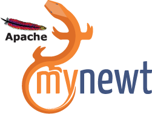
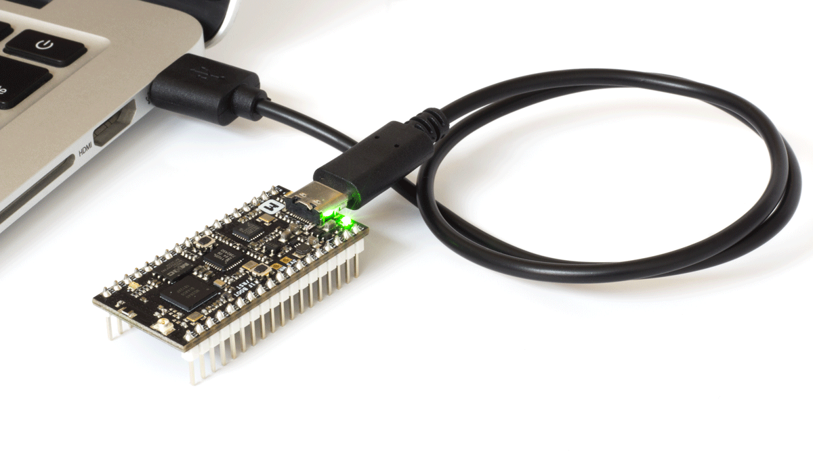

# Mynewt <br><small>An OS to build, deploy and securely manage billions of devices</small>

[](http://mynewt.apache.org)

## Introduction

Apache Mynewt is an operating system that makes it easy to develop applications for microcontroller environments where power and cost are driving factors. Examples of these devices are connected locks, lights, and wearables.

As more and more devices get connected, these interconnected devices perform complex tasks. To perform these tasks, you need low-level operational functionality built into the operating system. Typically, connected devices built with these microcontrollers perform a myriad of functions:

* Networking Stacks: Bluetooth Low Energy and Thread

* Peripherals: PWM to drive motors, ADCs to measure sensor data, and RTCs to keep time.

* Scheduled Processing: actions must happen on a calendared or periodic basis.

Apache Mynewt accomplishes all the above easily, by providing a complete operating system for constrained devices, including:

* A fully open-source Bluetooth Low Energy stack with both Host and Controller implementations.

* A pre-emptive, multi-tasking Real Time operating system kernel

* A Hardware Abstraction Layer (HAL) that abstracts the MCU's peripheral functions, allowing developers to easily write cross-platform code.

## Newt

In order to provide all this functionality, and operate in an extremely low resource environment, Mynewt provides a very fine-grained source package management and build system tool, called `newt`.

You can install newt for [macOS](#installing-newt-on-macos), [Linux](#installing-newt-on-linux), or [Windows](#installing-newt-on-windows).

### Installing Newt on macOS

Newt is supported on macOS 64 bit platforms and has been tested on macOS Sierra.

If this is your first time installing newt, add the `runtimeco/homebrew-mynewt` tap:

``` sh
$ brew tap runtimeco/homebrew-mynewt
$ brew update
```

Run the following command to install the latest release version of newt:

``` sh
$ brew update
$ brew install mynewt-newt
```

### Installing Newt on Linux

Run the following commands to upgrade or install the latest version of newt:

``` sh
$ sudo apt-get update
$ sudo apt-get install newt
```

!!! note
	If you encounter build errors (such as missing `sys/mman.h`), please make sure you have a 32-bit glibc:
	``` sh
	$ sudo apt-get install gcc-multilib
	```

### Installing Newt on Windows

On Windows, we use MSYS2 as the development environment to build and run Mynewt OS applications for target boards. You can do so by performing the following steps:

<a href="http://www.msys2.org/"><button data-md-color-primary="indigo">Download</button></a>

1. Download and run the installer - "x86_64" for 64-bit, "i686" for 32-bit Windows.

2. Update the package database and core system packages with:

	``` sh
	$ pacman -Syu
	```

3. If needed, close MSYS2, run it again from Start menu. Update the rest with:

	``` sh
	$ pacman -Su
	```

4. Install dependencies:

	``` sh
	$ pacman -S git tar
	```

5. Download and unpack the newt source:

	``` sh
	$ wget -P /tmp https://github.com/apache/mynewt-newt/archive/mynewt_1_3_0_tag.tar.gz
	$ tar -xzf /tmp/mynewt_1_3_0_tag.tar.gz
	```

6. Run the `build.sh` to build the newt tool.

	``` sh
	$ cd mynewt-newt-mynewt_1_3_0_tag   
	$ ./build.sh
	$ rm /tmp/mynewt_1_3_0_tag.tar.gz
	```

7. You should see the `newt/newt.exe` executable. Move the executable to a bin directory in your PATH:

	``` sh
	$ mv newt/newt.exe /usr/bin
	```

## Blinky on nRF52840-MDK

Now you can try to build one of the examples. Will use the `blinky` example here to keep it simple.

Open terminal and change directory to:

``` sh
$ cd ./nrf52840-mdk/examples/mynewt/blinky
```

Install project dependencies using the `newt install` command:

``` sh
blinky$ newt install
apache-mynewt-core successfully installed version 0.0.0-none
mynewt_nrf52840_mdk successfully installed version 0.0.0-none
```

Several targets are already created for the Blinky application. You can run the `newt target show` command to verify the target settings:

``` sh
blinky$ newt target show
targets/my_blinky_sim
    app=apps/blinky
    bsp=@apache-mynewt-core/hw/bsp/native
    build_profile=debug
targets/nrf52_blinky
    app=apps/blinky
    bsp=@mynewt_nrf52840_mdk/hw/bsp/nrf52840_mdk
    build_profile=debug
targets/nrf52_boot
    app=@apache-mynewt-core/apps/boot
    bsp=@mynewt_nrf52840_mdk/hw/bsp/nrf52840_mdk
    build_profile=optimized
```


Now you can try to build the target executables.

Run the `newt build nrf52_boot` command to build the bootloader:

``` sh
blinky$ newt build nrf52_boot
Building target targets/nrf52_boot
Compiling repos/apache-mynewt-core/boot/bootutil/src/image_ec256.c
Compiling repos/apache-mynewt-core/boot/bootutil/src/image_ec.c
Compiling repos/apache-mynewt-core/apps/boot/src/boot.c
Compiling repos/apache-mynewt-core/boot/bootutil/src/bootutil_misc.c
Compiling repos/apache-mynewt-core/boot/bootutil/src/image_rsa.c
Compiling repos/apache-mynewt-core/boot/bootutil/src/image_validate.c
Compiling repos/apache-mynewt-core/boot/bootutil/src/loader.c
Compiling repos/apache-mynewt-core/crypto/mbedtls/src/aes.c
Compiling repos/apache-mynewt-core/crypto/mbedtls/src/aesni.c
Compiling repos/apache-mynewt-core/crypto/mbedtls/src/arc4.c
Compiling repos/apache-mynewt-core/crypto/mbedtls/src/asn1parse.c
Compiling repos/apache-mynewt-core/crypto/mbedtls/src/asn1write.c
Compiling repos/apache-mynewt-core/crypto/mbedtls/src/base64.c
...
Archiving nrf52_boot-sysinit-app.a
Archiving sys_flash_map.a
Archiving sys_mfg.a
Archiving sys_sysinit.a
Archiving util_mem.a
Linking /makerdiary/nrf52840-mdk/examples/mynewt/blinky/bin/targets/nrf52_boot/app/apps/boot/boot.elf
Target successfully built: targets/nrf52_boot
```

Run the `newt build nrf52_blinky` command to build the Blinky application:

``` sh
blinky$ newt build nrf52_blinky
Building target targets/nrf52_blinky
Assembling repos/mynewt_nrf52840_mdk/hw/bsp/nrf52840_mdk/src/arch/cortex_m4/gcc_startup_nrf52840.s
Compiling repos/mynewt_nrf52840_mdk/hw/bsp/nrf52840_mdk/src/sbrk.c
Compiling apps/blinky/src/main.c
Assembling repos/mynewt_nrf52840_mdk/hw/bsp/nrf52840_mdk/src/arch/cortex_m4/gcc_startup_nrf52_split.s
Compiling repos/mynewt_nrf52840_mdk/hw/bsp/nrf52840_mdk/src/hal_bsp.c
Compiling repos/apache-mynewt-core/hw/drivers/uart/src/uart.c
Compiling repos/apache-mynewt-core/hw/cmsis-core/src/cmsis_nvic.c
Compiling repos/apache-mynewt-core/hw/hal/src/hal_common.c
Compiling repos/apache-mynewt-core/hw/drivers/uart/uart_hal/src/uart_hal.c
Compiling repos/apache-mynewt-core/hw/hal/src/hal_flash.c
...
Archiving nrf52_blinky-sysinit-app.a
Archiving sys_flash_map.a
Archiving sys_mfg.a
Archiving sys_sysinit.a
Archiving util_mem.a
Linking /makerdiary/nrf52840-mdk/examples/mynewt/blinky/bin/targets/nrf52_blinky/app/apps/blinky/blinky.elf
Target successfully built: targets/nrf52_blinky
```

Run the `newt create-image nrf52_blinky 1.0.0` command to create and sign the application image. You may assign an arbitrary version (e.g. `1.0.0`) to the image.

``` sh
blinky$ newt create-image nrf52_blinky 1.0.0
App image succesfully generated: /makerdiary/nrf52840-mdk/examples/mynewt/blinky/bin/targets/nrf52_blinky/app/apps/blinky/blinky.img
```

Everything goes well, now you can connect to the board and load the firmware:

!!! note
    nRF52840-MDK supports OpenOCD debugger. OpenOCD version 0.10.0 with nrf52 support is required. A binary for this version is available to download for Mac OS, Linux, and Windows. Follow [this guide](https://mynewt.apache.org/latest/os/get_started/cross_tools/#installing-openocd-on-mac-os) to install it.

Run the `newt load nrf52_boot` command to load the bootloader onto the board:

``` sh
blinky$ newt load nrf52_boot
Loading bootloader
```

Run the `newt load nrf52_blinky` command to load the Blinky application image onto the board.

``` sh
blinky$ newt load nrf52_blinky
Loading app image into slot 1
```

Observe that the GREEN LED is blinking:



## Create Your First Project 

### Creating a New Project

Choose a name for your project. We name the project `myproj`.

Run the newt new myproj command, from your `dev` directory, to create a new project:

``` sh
$cd ~/dev
$ newt new myproj
Downloading project skeleton from apache/mynewt-blinky...
Installing skeleton in myproj...
Project myproj successfully created.
```

The newt tool creates a project base directory name myproj. All newt tool commands are run from the project base directory. The newt tool populates this new project with a base skeleton of a new Apache Mynewt project in the project base directory. It has the following structure:

``` sh
.
├── LICENSE
├── NOTICE
├── README.md
├── apps
│   └── blinky
│       ├── pkg.yml
│       └── src
│           └── main.c
├── project.yml
└── targets
    ├── my_blinky_sim
    │   ├── pkg.yml
    │   └── target.yml
    └── unittest
        ├── pkg.yml
        └── target.yml

6 directories, 10 files
```

### Fetching External Packages

To fetch the package with board support for nRF52840-MDK from the [makerdiary/mynewt_nrf52840_mdk](https://github.com/makerdiary/mynewt_nrf52840_mdk) git repository, you need to add the repository to the `project.yml` file in your base project directory.

Here is an example `project.yml` file with the `mynewt_nrf52840_mdk` repository added. 

!!! note
    You need to set `vers` to `0-dev` and use the latest master branch for both repositories.

``` sh
project.name: "myproj"

project.repositories:
    - apache-mynewt-core
    - mynewt_nrf52840_mdk

# Use github's distribution mechanism for core ASF libraries.
# This provides mirroring automatically for us.
#
repository.apache-mynewt-core:
    type: github
    vers: 0-dev
    user: apache
    repo: mynewt-core

# a special repo to hold hardware specific stuff for nRF52840-MDK
repository.mynewt_nrf52840_mdk:
    type: github
    vers: 0-dev
    user: makerdiary
    repo: mynewt_nrf52840_mdk
```

Install project dependencies using the `newt install` command:

``` sh
myproj$ newt install
apache-mynewt-core successfully installed version 0.0.0-none
mynewt_nrf52840_mdk successfully installed version 0.0.0-none
```

### Creating the Targets

Create two targets for the nRF52840-MDK board - one for the bootloader and one for the your application.

Run the following `newt target` commands, from your project directory, to create a bootloader target. We name the target `nrf52_boot`:

``` sh
myproj$ newt target create nrf52_boot
myproj$ newt target set nrf52_boot app=@apache-mynewt-core/apps/boot
myproj$ newt target set nrf52_boot bsp=@mynewt_nrf52840_mdk/hw/bsp/nrf52840_mdk
myproj$ newt target set nrf52_boot build_profile=optimized
```

Run the following `newt target` commands to create a target for the Blinky application. We name the target `nrf52_blinky`.

``` sh
myproj$ newt target create nrf52_blinky
myproj$ newt target set nrf52_blinky app=apps/blinky
myproj$ newt target set nrf52_blinky bsp=@mynewt_nrf52840_mdk/hw/bsp/nrf52840_mdk
myproj$ newt target set nrf52_blinky build_profile=debug
```

You can run the `newt target show` command to verify the target settings:

``` sh
myproj$ newt target show
targets/my_blinky_sim
    app=apps/blinky
    bsp=@apache-mynewt-core/hw/bsp/native
    build_profile=debug
targets/nrf52_blinky
    app=apps/blinky
    bsp=@mynewt_nrf52840_mdk/hw/bsp/nrf52840_mdk
    build_profile=debug
targets/nrf52_boot
    app=@apache-mynewt-core/apps/boot
    bsp=@mynewt_nrf52840_mdk/hw/bsp/nrf52840_mdk
    build_profile=optimized
```

### Building the Target Executables

Run the following commands to build the bootloader and application:

``` sh
myproj$ newt build nrf52_boot
myproj$ newt build nrf52_blinky
```

### Loading the images

First run the `newt create-image nrf52_blinky 1.0.0` command to create and sign the application image. You may assign an arbitrary version (e.g. `1.0.0`) to the image.

``` sh
myproj$ newt create-image nrf52_blinky 1.0.0
```

Run the `newt load nrf52_boot` command to load the bootloader onto the board:

``` sh
myproj$ newt load nrf52_boot
Loading bootloader
```

Run the `newt load nrf52_blinky` command to load the Blinky application image onto the board.

``` sh
myproj$ newt load nrf52_blinky
Loading app image into slot 1
```

Now observe if the application is running in the right way.

## Explore other Mynewt OS Features

Congratulations! You have created your first project! Apache Mynewt has a lot more functionality. Over time, more example applications will be added to the repository. You can star or watch the [nrf52840-mdk](https://github.com/makerdiary/nrf52840-mdk) repository to stay up to date.

Happy Hacking!

## Reference

* [Apache Mynewt Official site](https://mynewt.apache.org/)
* [Apache Mynewt Documentation](https://mynewt.apache.org/documentation/)
* [Apache/mynewt-core repository](https://github.com/apache/mynewt-core)

## Create an Issue

Interested in contributing to this project? Want to report a bug? Feel free and click here:

<a href="https://github.com/makerdiary/nrf52840-mdk/issues/new"><button data-md-color-primary="marsala"><i class="fa fa-github"></i> Create an Issue</button></a>

